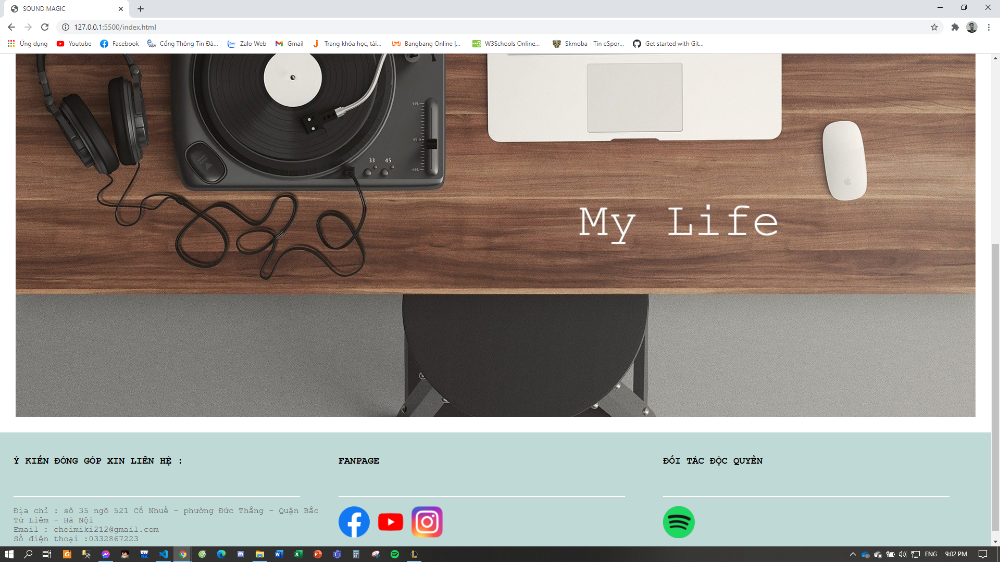
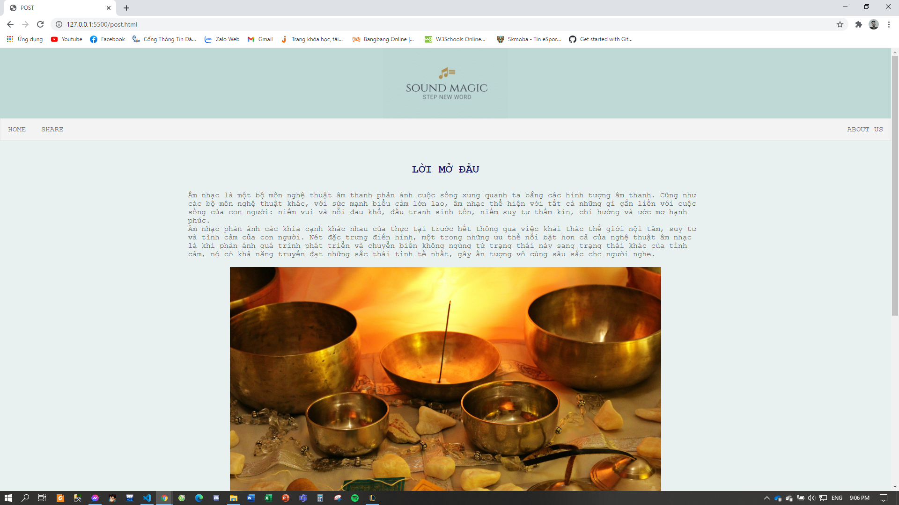
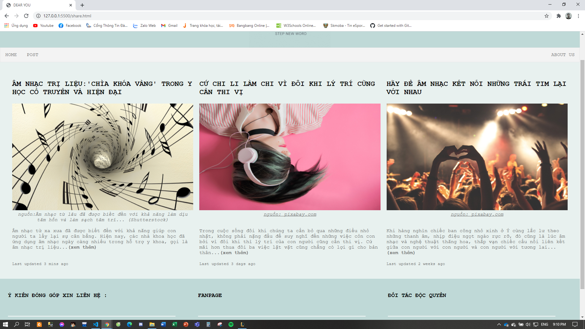
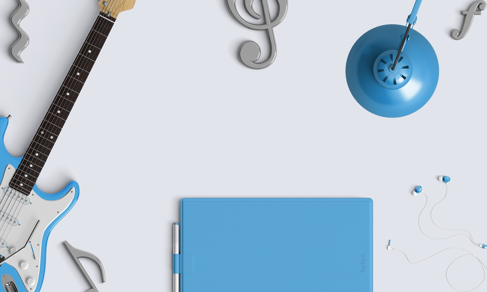
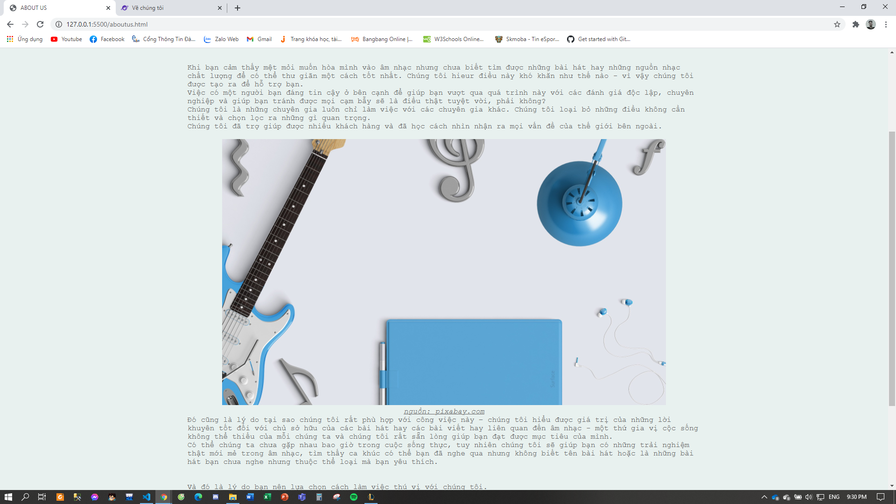

Đây là trang web giành cho những người yêu âm nhạc thích sự mới mẻ trong âm nhạc. Nơi cộng đồng chia sẻ về âm nhạc. Những bài viết hay về âm nhạc - gia vị cuộc sống.
# MÃ NGUỒN
```html
<html lang="en">

<head>
    <meta charset="UTF-8">
    <meta name="viewport" content="width=device-width, initial-scale=1.0">
    <title>SOUND MAGIC</title>
    <link rel="StyleSheet" href="./css/style.css">
    <link rel="StyleSheet" href="./css/home.css">
    <script src="https://ajax.googleapis.com/ajax/libs/jquery/2.1.1/jquery.min.js"></script>

</head>

<body>
    <header>
        
    </header>
    <nav>
        <div class="topnav">
                <a href="#" target="blank">HOME</a>
                <a href="./post.html">POST</a>
                <a href="./share.html" class="dropbtn">SHARE</a>
                <a style="float: right;" href="./aboutus.html">ABOUT US</a>
        </div>
    </nav>
    <section>
        <picture>
            
        </picture>
    </section>
    <footer>
        <div class="footer">
            <br>
            <div class="row">
                <div class="column">
                    <h3>Ý KIẾN ĐÓNG GÓP XIN LIÊN HỆ :</h3>
                    <br>
                    <div style="border: 1px solid white; max-width: 550px;"></div>
                    <br>
                    <div>Địa chỉ : sô 35 ngõ 521 Cổ Nhuế - phường Đức Thắng - Quận Bắc Từ Liêm - Hà Nội</div>
                    <div>Email : choimiki212@gmail.com</div>
                    <div>Số điện thoại :0332867223</div>
                </div>
                <div class="row">
                    <div class="column">
                        <h3>FANPAGE</h3>
                        <br>
                        <div style="border: 1px solid white; max-width: 550px;"></div>
                        <br>
                        <a href="https://www.facebook.com/groups/fallinluv.music" target="blank"></a>
                        <a href="#" target="blank"></a>
                        <a href="#" target="blank"></a>
                    </div>
                    <div class="column">
                        <h3>ĐỐI TÁC ĐỘC QUYỀN</h3>
                        <br>
                        <div style="border: 1px solid white; max-width: 550px;"></div>
                        <br>
                        <a href="https://www.spotify.com/vn-vi/" target="blank"></a>
                    </div>
                </div>
            </div>
        </div>
    </footer>
    <script>
        $(function() {
            $('nav ul li a').click(function() {
                // Lấy section để hiển thị
                var $section = $('#' + $(this).data('section'));

                // Nếu đang hiện thì không làm gì.
                // Nếu không, ẩn tất cả các se cho hiện (kiểu fade in) phần mong muốn.
                if (!$section.is(':visible')) {
                    $('.hideable-section').hide();
                    $section.fadeIn();
                }
            });
        });
    </script>
</body>

</html>
```
#KẾT QUẢ

#MÃ NGUỒN
```html
<!DOCTYPE html>
<html lang="en">
<head>
    <meta charset="UTF-8">
    <meta name="viewport" content="width=device-width, initial-scale=1.0">
    <title>POST</title>
    <link rel="StyleSheet" href="./css/style.css">
    <link rel="StyleSheet" href="./css/home.css">
</head>
<body>
    <header>
        
    </header>
    <nav>
        <ul>
            <li><a data-section="home" href="./index.html">HOME</a></li>
            <li><a data-section="services" href="./share.html">SHARE</a></li>
            <li style="float: right;" class="dropdown">
                <a href="./aboutus.html" class="dropbtn">ABOUT US</a>
            </li>
        </ul>
    </nav>
    <div style="background-color: rgb(232, 241, 239); width: 100%; height: 100%;">
        <section id="home" class="hideable-section"><br>
            <h2 style="color: midnightblue; text-align: center;">LỜI MỞ ĐẦU</h2>
            <p>Âm nhạc là một bộ môn nghệ thuật âm thanh phản ánh cuộc sống xung quanh ta bằng các hình tượng âm thanh.
            Cũng như các bộ môn nghệ thuật khác, với sức mạnh biểu cảm lớn lao, 
            âm nhạc thể hiện với tất cả những gì gắn liền với cuộc sống của con người: niềm vui và nỗi đau khổ, 
            đấu tranh sinh tồn, niềm suy tư thầm kín, chí hướng và ước mơ hạnh phúc.</p>
            <p>Âm nhạc phản ánh các khía cạnh khác nhau của thực tại trước hết thông qua việc khai thác thế giới nội tâm, 
            suy tư và tình cảm của con người. Nét đặc trưng điển hình, một trong những ưu thế nổi bật hơn cả của nghệ thuật âm nhạc là khi phản ánh quá trình phát triển 
            và chuyển biến không ngừng từ trạng thái này sang trạng thái khác của tình cảm, 
            nó có khả năng truyền đạt những sắc thái tinh tế nhất, gây ấn tượng vô cùng sâu sắc cho người nghe.</p>
            <br>
            <picture>
                
            </picture>
            
            <br>
            <p style="text-align: center; font-style: italic;">nguồn: Âm nhạc và cuộc sống</p><br>
            <p>Âm nhạc từ xa xưa đã được biết đến với khả năng giúp con người ta lấy lại sự cân bằng. 
            Hiện nay, các nhà khoa học đã ứng dụng âm nhạc ngày càng nhiều trong hỗ trợ y khoa, gọi là âm nhạc trị liệu</p>
            <p>Âm nhạc như một liều thuốc an thần. Thường thì bắt đầu một ngày làm việc và có thể là sau những giờ làm việc 
            mệt mỏi bạn có thể nghe một bản nhạc để con người trở nên thoải mái và sảng khoái hơn.</p><br><br>
            <p>Hãy đến với chúng tôi để thả hồn vào những giai điệu bất tận này</p><br>
            <h3 style="text-align: center; color: black;">XIN CẢM ƠN !</h3>
        </section>
        <footer>
            <div class="footer">
                <br>
                <div class="row">
                    <div class="column">
                        <h3>Ý KIẾN ĐÓNG GÓP XIN LIÊN HỆ :</h3>
                        <br>
                        <div style="border: 1px solid white; max-width: 550px;"></div>
                        <br>
                        <div>Địa chỉ : sô 35 ngõ 521 Cổ Nhuế - phường Đức Thắng - Quận Bắc Từ Liêm - Hà Nội</div>
                        <div>Email : choimiki212@gmail.com</div>
                        <div>Số điện thoại :0332867223</div>
                    </div>
                    <div class="row">
                        <div class="column">
                            <h3>FANPAGE</h3>
                            <br>
                            <div style="border: 1px solid white; max-width: 550px;"></div>
                            <br>
                            <a href="https://www.facebook.com/groups/fallinluv.music" target="blank"></a>
                            <a href=""></a>
                            <a href=""></a>
                        </div>
                        <div class="column">
                            <h3>ĐỐI TÁC ĐỘC QUYỀN</h3>
                            <br>
                            <div style="border: 1px solid white; max-width: 550px;"></div>
                            <br>
                            <a href="https://www.spotify.com/vn-vi/" target="blank"></a>
                        </div>
                    </div>
                </div>
            </div>
        </footer>
</body>
</html>
```
#KẾT QUẢ


#MÃ NGUỒN
```html
<!DOCTYPE html>
<html lang="en">
<head>
    <meta charset="UTF-8">
    <meta name="viewport" content="width=device-width, initial-scale=1.0">
    <title>DEAR YOU</title>
    <link rel="StyleSheet" href="./css/style.css">
    <link rel="StyleSheet" href="./css/home.css">
</head>
<body>
    <header>
        
    </header>
    <nav>
        <ul>
            <li><a data-section="home" href="./index.html">HOME</a></li>
            <li><a data-section="services" href="./post.html">POST</a></li>
            <li style="float: right;" class="dropdown">
                <a href="./aboutus.html" class="dropbtn">ABOUT US</a>
            </li>
        </ul>
    </nav>
    <div style="background-color: rgb(232, 241, 239); width: 100%; height: 100%;">
        <section id="home" class="hideable-section"><br>
            <div class="row">
                <div class="column">
                    <h2>ÂM NHẠC TRỊ LIỆU:'CHÌA KHÓA VÀNG' TRONG Y HỌC CỔ TRUYỀN VÀ HIỆN ĐẠI</h2><br>
                    <picture>
                        
                    </picture>
                    <p style="text-align: center; font-style: italic;">nguồn:Âm nhạc từ lâu đã được biết đến với khả năng làm dịu tâm hồn và làm sạch tâm trí... (Shutterstock)</p><br>
                    <p>Âm nhạc từ xa xưa đã được biết đến với khả năng giúp con người ta lấy lại sự cân bằng. 
                    Hiện nay, các nhà khoa học đã ứng dụng âm nhạc ngày càng nhiều trong hỗ trợ y khoa, gọi là âm nhạc trị liệu...<strong>(xem thêm)</strong></p>
                    <br><br>
                    <p class="card-text"><small class="text-muted">Last updated 3 mins ago</small></p>
                </div>
                <div class="column">
                    <h2>CỨ CHI LI LÀM CHI VÌ ĐÔI KHI LÝ TRÍ CŨNG CẦN THI VỊ</h2><br>
                    <picture>
                        
                    </picture>
                    <a href="https://pixabay.com/" target="blank"><p style="text-align: center; font-style: italic;">nguồn: pixabay.com</p></a><br><br>
                    <p>Trong cuộc sống đôi khi chúng ta cần bỏ qua những điều nhỏ nhặt, không phải nặng đầu để suy nghĩ đến những việc cỏn con bởi vì đôi khi thì lý trí của con người cũng cần thi vị. 
                    Cứ mãi hơn thua đôi ba việc lặt vặt cũng chẳng có lợi gì cho bản thân...<strong>(xem thêm)</strong></p><br>
                    <p class="card-text"><small class="text-muted">Last updated 3 days ago</small></p>
                </div>
                <div class="column">
                    <h2>HÃY ĐỂ ÂM NHẠC KẾT NỐI NHỮNG TRÁI TIM LẠI VỚI NHAU</h2><br>
                    <picture>
                        
                    </picture>
                    <a href="https://pixabay.com/" target="blank"><p style="text-align: center; font-style: italic;">nguồn: pixabay.com</p></a><br><br>
                    <p>Khi hàng nghìn chiếc ban công nhỏ xinh ở Ý cùng lắc lư theo những thanh âm, nhịp điệu ngọt ngào rực rỡ, đó cũng là lúc âm nhạc và nghệ thuật thăng hoa, 
                    thắp vạn chiếc cầu nối liên kết giữa con người với con người và con người với tương lai...<strong>(xem thêm)</strong></p><br>
                    <p class="card-text"><small class="text-muted">Last updated 2 weeks ago</small></p>
                </div>
            </div>
        </section>
    </div>
        <footer>
            <div class="footer">
                <br>
                <div class="row">
                    <div class="column">
                        <h3>Ý KIẾN ĐÓNG GÓP XIN LIÊN HỆ :</h3>
                        <br>
                        <div style="border: 1px solid white; max-width: 550px;"></div>
                        <br>
                        <div>Địa chỉ : sô 35 ngõ 521 Cổ Nhuế - phường Đức Thắng - Quận Bắc Từ Liêm - Hà Nội</div>
                        <div>Email : choimiki212@gmail.com</div>
                        <div>Số điện thoại :0332867223</div>
                    </div>
                    <div class="row">
                        <div class="column">
                            <h3>FANPAGE</h3>
                            <br>
                            <div style="border: 1px solid white; max-width: 550px;"></div>
                            <br>
                            <a href="https://www.facebook.com/groups/fallinluv.music" target="blank"></a>
                            <a href=""></a>
                            <a href=""></a>
                        </div>
                        <div class="column">
                            <h3>ĐỐI TÁC ĐỘC QUYỀN</h3>
                            <br>
                            <div style="border: 1px solid white; max-width: 550px;"></div>
                            <br>
                            <a href="https://www.spotify.com/vn-vi/" target="blank"></a>
                        </div>
                    </div>
                </div>
            </div>
        </footer>
</body>
</html>
```
#KẾT QUẢ


#MÃ NGUỒN
```html
<!DOCTYPE html>
<html lang="en">
<head>
    <meta charset="UTF-8">
    <meta name="viewport" content="width=device-width, initial-scale=1.0">
    <title>ABOUT US</title>
    <link rel="StyleSheet" href="./css/style.css">
    <link rel="StyleSheet" href="./css/home.css">
</head>
<body>
    <header>
        
    </header>
    <nav>
        <ul>
            <li><a data-section="home" href="./index.html">HOME</a></li>
            <li><a data-section="services" href="./post.html">POST</a></li>
            <li class="dropdown">
                <a href="./share.html" class="dropbtn">SHARE</a>
            </li>
        </ul>
    </nav>
    <div style="background-color: rgb(232, 241, 239); width: 100%; height: 100%;">
        <section>
            <br>
            <h2 style="color: midnightblue; text-align: center;">MỤC ĐÍCH CỦA TRANG WEB</h2>
            <br>
            <p>Khi bạn cảm thấy mệt mỏi muốn hòa mình vào âm nhạc nhưng chưa biết tìm được những bài hát hay những nguồn nhạc chất lượng để có thể thư giãn một cách tốt nhất. Chúng tôi hieur điều này khó khăn như thế nào - vì vậy chúng tôi được tạo ra để hỗ trợ bạn.</p>
            <p>Việc có một người bạn đáng tin cậy ở bên cạnh để giúp bạn vượt qua quá trình này với các đánh giá độc lập, chuyên nghiệp và giúp bạn tránh được mọi cạm bẫy sẽ là điều thật tuyệt vời, phải không?</p>
            <p>Chúng tôi là những chuyên gia luôn chỉ làm việc với các chuyên gia khác. Chúng tôi loại bỏ những điều không cần thiết và chọn lọc ra những gì quan trọng.</p>
            <p>Chúng tôi đã trợ giúp được nhiều khách hàng và đã học cách nhìn nhận ra mọi vấn đề của thế giới bên ngoài.</p>
            <br>
            <picture>
                
            </picture>
            <br>
            <a href="https://pixabay.com/" target="blank"><p style="text-align: center; font-style: italic;">nguồn: pixabay.com</p></a>
            <p>Đó cũng là lý do tại sao chúng tôi rất phù hợp với công việc này – chúng tôi hiểu được giá trị của những lời khuyên tốt 
            đối với chủ sở hữu của các bài hát hay các bài viết hay liên quan đến âm nhạc - một thứ gia vị cộc sống không thể thiếu của mỗi chúng ta và chúng tôi rất sẵn lòng giúp bạn đạt được mục tiêu của mình.</p>
            <p>Có thể chúng ta chưa gặp nhau bao giờ trong cuộc sống thực, tuy nhiên chúng tôi sẽ giúp bạn có những trải nghiệm thật mới mẻ trong âm nhạc, tìm thấy ca khúc có thể bạn đã nghe qua nhưng không biết tên bài hát hoặc là những bài hát bạn chưa nghe nhưng thuộc thể loại mà bạn yêu thích.</p><br><br>
            <p>Và đó là lý do bạn nên lựa chọn cách làm việc thú vị với chúng tôi.</p><br>
        </section>
    </div>
    <footer>
        <div class="footer">
            <br>
            <div class="row">
                <div class="column">
                    <h3>Ý KIẾN ĐÓNG GÓP XIN LIÊN HỆ :</h3>
                    <br>
                    <div style="border: 1px solid white; max-width: 550px;"></div>
                    <br>
                    <div>Địa chỉ : sô 35 ngõ 521 Cổ Nhuế - phường Đức Thắng - Quận Bắc Từ Liêm - Hà Nội</div>
                    <div>Email : choimiki212@gmail.com</div>
                    <div>Số điện thoại :0332867223</div>
                </div>
                <div class="row">
                    <div class="column">
                        <h3>FANPAGE</h3>
                        <br>
                        <div style="border: 1px solid white; max-width: 550px;"></div>
                        <br>
                        <a href="https://www.facebook.com/groups/fallinluv.music" target="blank"></a>
                        <a href=""></a>
                        <a href=""></a>
                    </div>
                    <div class="column">
                        <h3>ĐỐI TÁC ĐỘC QUYỀN</h3>
                        <br>
                        <div style="border: 1px solid white; max-width: 550px;"></div>
                        <br>
                        <a href="https://www.spotify.com/vn-vi/" target="blank"></a>
                    </div>
                </div>
            </div>
        </div>
    </footer>
</body>
</html>
```
#KẾT QUẢ

